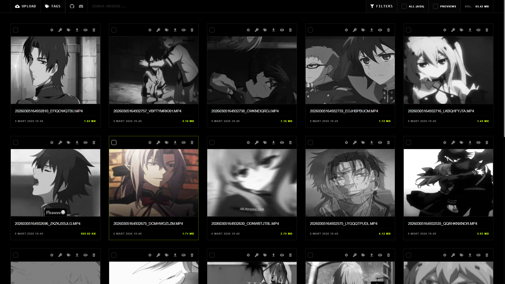
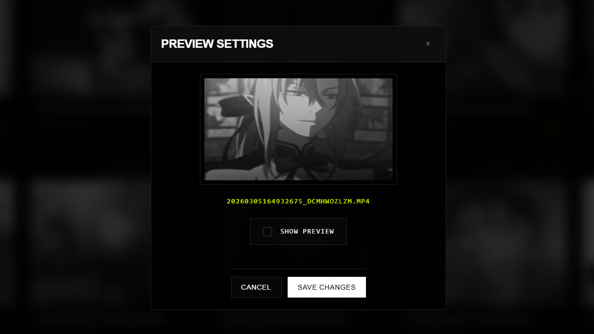
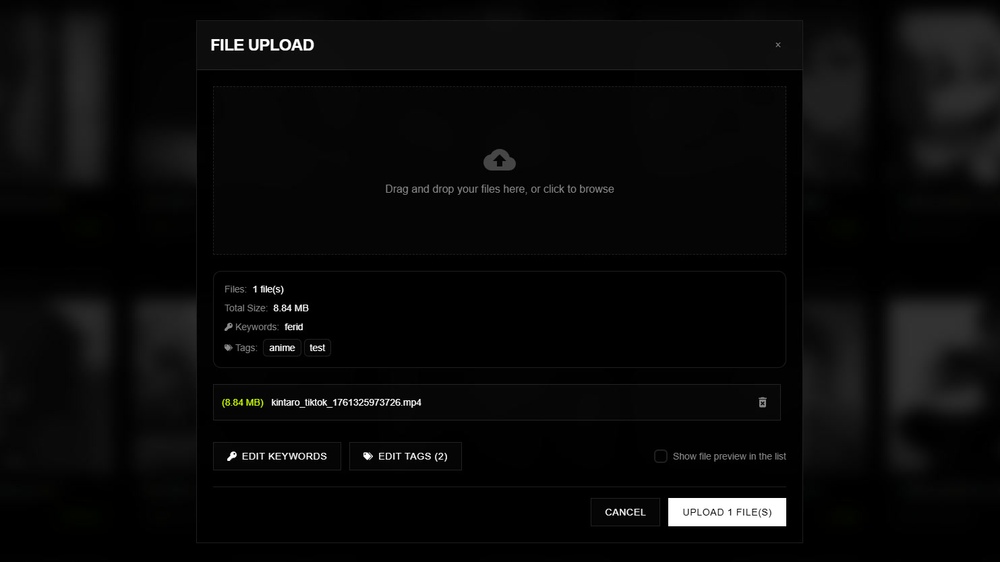
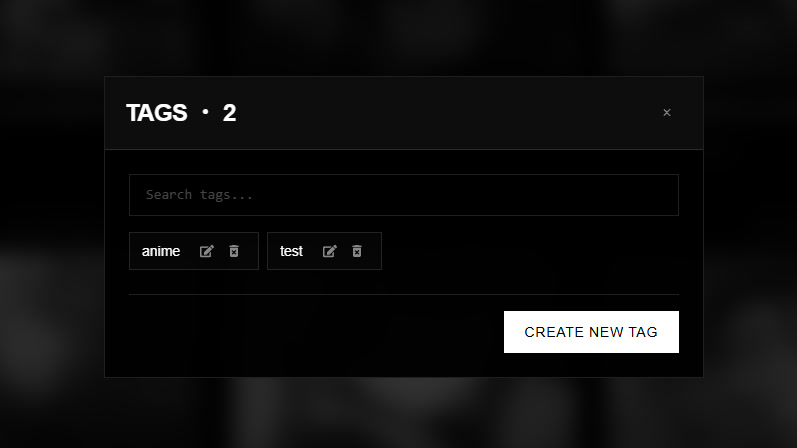

<a href="README.md">
  
</a>
<a href="README-TR.md">
  
</a>

  <br />
  <br />

<div align="center">
  

  <br />
  <br />

  <p>
    Dosyalarınızı Cyberpunk temasıyla yönetin ve kategorize edin.
  </p>


  <p>
    <a href="#features">Özellikler</a> •
    <a href="#tech">Teknolojiler</a> •
    <a href="#installation">Kurulum</a> •
    <a href="#license">Lisans</a> •
    <a href="#gallery">Galeri</a>
  </p>

  <br />
  <br />
</div>

## 📋 Hakkında

**File Manager**, cyberpunk esintili bir arayüze sahip, self-hosted bir dosya yönetimi uygulamasıdır. SQLite destekli şık ve modern bir web arayüzü üzerinden her türlü dosyayı yüklemenize, düzenlemenize, etiketlemenize ve filtrelemenize olanak tanır — harici bir veritabanı gerektirmez.

Tüm dosyalar yerel olarak makinenizde saklanır — bulut yok, üçüncü taraf sunucular yok. Dosyalarınızı yükleyin, etiketler ve anahtar kelimeler atayın ve güçlü filtreleme ile anında bulun. Uygulama, resimler ve videolar için otomatik olarak küçük resimler (thumbnails) oluşturarak tüm arşivinize görsel bir genel bakış sunar.



## ✨ Özellikler <a id="features"></a>

### 📤 Dosya Yükleme

Dosyaları sürükle-bırak arayüzü veya geleneksel dosya seçici aracılığıyla yükleyin.

- **Sürükle & Bırak**: Anında kuyruğa eklemek için dosyaları doğrudan yükleme alanına bırakın.
- **Çoklu Dosya Yükleme**: Aynı anda birden fazla dosyayı seçin ve yükleyin.
- **Yükleme Sırasında Etiketleme**: Yükleme işlemi sırasında dosyalara etiketler atayın.
- **Yükleme Sırasında Anahtar Kelime**: Yüklemeden önce dosyalara aranabilir anahtar kelimeler ekleyin.
- **Önizleme Anahtarı**: Yükleme sırasında dosya önizlemesinin gösterilip gösterilmeyeceğini seçin.
- Tüm dosya türlerini destekler — resimler, videolar, sesler, belgeler, arşivler ve daha fazlası.

### 🏷️ Etiket Yönetimi

Dosyalarınızı kategorize etmek için özel bir etiket sistemi oluşturun ve yönetin.

- **Etiket Oluşturma**: Özel etiket paneli üzerinden özel etiketler tanımlayın.
- **Etiketleri Düzenleme**: Mevcut etiketleri istediğiniz zaman yeniden adlandırın.
- **Etiketleri Silme**: Artık ihtiyaç duyulmayan etiketleri kaldırın.
- **Etiket Atama**: Bir modal arayüzü aracılığıyla herhangi bir dosyaya bir veya daha fazla etiket ekleyin.
- **Etiket Arama**: Atama veya filtreleme yaparken etiketleriniz arasında arama yapın.

### 🔑 Anahtar Kelime Sistemi

Ayrıntılı arama ve keşif için dosyalara anahtar kelimeler ekleyin.

- **Dosya Başına Anahtar Kelimeler**: Tekil dosyalara virgülle ayrılmış anahtar kelimeler atayın.
- **Anahtar Kelimeleri Düzenleme**: Anahtar kelimeleri istediğiniz zaman özel bir modal üzerinden güncelleyin.
- **Anahtar Kelime Araması**: Arşivinizde anahtar kelimeye göre anında arama yapın.

### 🔍 Gelişmiş Filtreleme

Çok katmanlı filtreleme seçenekleriyle tam olarak ihtiyacınız olanı bulun.

- **Anahtar Kelime Araması**: Dosyaları anahtar kelimelerine göre filtreleyen gerçek zamanlı arama çubuğu.
- **Etiket Filtreleme**: Filtre modalını açın ve sonuçları daraltmak için bir veya daha fazla etiket seçin.
- **AND / OR Mantığı**: AND (dosyalar seçilen tüm etiketlerle eşleşmelidir) ve OR (dosyalar seçilen etiketlerden herhangi biriyle eşleşmelidir) filtreleme modları arasında geçiş yapın.
- **Filtre İçinde Etiket Arama**: Doğrudan filtre modalı içinde etiketler arasında arama yapın.
- **Birleşik Filtreler**: Anahtar kelime aramasını ve etiket filtrelerini aynı anda uygulayın.

### 🖼️ Küçük Resimler & Önizleme

Otomatik küçük resim (thumbnail) oluşturma, arşivinize görsel bir genel bakış sağlar.

- **Resim Küçük Resimleri**: Bir resim yüklendiğinde Sharp aracılığıyla otomatik olarak oluşturulur.
- **Video Küçük Resimleri**: FFmpeg kullanılarak ilk kareden çıkarılır.
- **Tarayıcı İçi Önizleme**: Dosyaları doğrudan tarayıcıda görüntüleyin — PDF, resimler, videolar, ses, düz metin, markdown, JSON, YAML, Office belgeleri (DOCX, XLSX, PPTX) ve daha fazlası dahil olmak üzere 30'dan fazla MIME türünü destekler.
- **Önizleme Anahtarı**: Ayarlar düğmesi aracılığıyla dosya bazında küçük resimleri gösterin veya gizleyin.
- **Tüm Önizlemeleri Zorla**: Bireysel önizleme ayarlarını geçersiz kılmak ve tüm küçük resimleri görüntülemek için genel anahtar.
- **Gri Tonlamadan Renkliye**: Dosya kartları gri tonlamalı olarak görüntülenir ve üzerine gelindiğinde (hover) sorunsuz bir şekilde tam renge geçer.

### ⬇️ İndirme & Dışa Aktarma

Dosyaları tek tek veya toplu olarak indirin.

- **Tekli İndirme**: Herhangi bir dosyayı tek tıkla indirin.
- **Toplu İndirme**: Birden fazla dosyayı seçin ve bunları tek bir `.zip` arşivi olarak indirin.
- **Zaman Damgalı Arşivler**: ZIP dosyaları, kolay tanımlama için bir zaman damgası ile adlandırılır.

### 🗑️ Dosya Silme

Dosyaları onay alarak arşivinizden kaldırın.

- **Tekli Silme**: Dosya kartı eylemlerinden tekil dosyaları silin.
- **Toplu Silme**: Birden fazla dosyayı seçin ve hepsini tek seferde silin.
- **Onay İletişim Kutusu**: Bir onay istemi ile yanlışlıkla silmeleri önler.
- **Otomatik Temizlik**: Hem orijinal dosyayı hem de küçük resmini diskten siler.

### ✅ Seçim & Toplu İşlemler

Sezgisel seçim kontrolleriyle dosyaları toplu olarak yönetin.

- **Bireysel Seçim**: Her dosya kartında seçimi açıp kapatın.
- **Tümünü Seç / Tüm Seçimi Kaldır**: Görünür tüm dosyaları tek bir tıklamayla seçin veya seçimini kaldırın.
- **Seçim Sayacı**: Şu anda görünür olan setten kaç dosyanın seçildiğini görün.
- **Hacim Göstergesi**: Arşivinizin toplam depolama hacmini bir bakışta görün.

### 🎨 Cyberpunk UI

Güçlü kullanıcılar için tasarlanmış karanlık, modern bir arayüz.

- **Koyu Glassmorphism**: Yarı saydam yüzeyler ve ince kenarlıklarla derin siyah arka plan.
- **Neon Vurgu Renkleri**: Tamamlayıcı hata, başarı ve uyarı renkleri ile elektrik yeşili (`#ccff00`) vurgu.
- **Modern Tipografi**: Başlıklar için Syne, gövde metni için Plus Jakarta Sans — Google Fonts'tan içe aktarılmıştır.
- **Duyarlı Tasarım**: Mobilden ultra geniş ekranlara kadar uyum sağlayan tam duyarlı (responsive) düzen.
- **Pürüzsüz Geçişler**: Dosya kartlarında hover efektleri, renk geçişleri ve ölçeklendirme animasyonları.
- **Sayfalandırma**: Dosyalar, optimum performans için "Daha Fazla Yükle" düğmesi ile 50'şerli gruplar halinde yüklenir.

## <a id="tech"></a>🛠️ Teknolojiler

### Backend

- **Node.js**: Sunucu için JavaScript runtime.
- **Express**: REST API uç noktaları için minimal web framework.
- **SQLite** + **better-sqlite3**: Sıfır harici bağımlılığa sahip gömülü SQL veritabanı.
- **Multer**: multipart/form-data dosya yüklemelerini işlemek için middleware.
- **Sharp**: Küçük resim oluşturma için yüksek performanslı görüntü işleme.
- **Fluent-FFmpeg**: Video küçük resmi çıkarma için FFmpeg sarmalayıcısı.
- **Archiver**: Toplu indirmeler için ZIP arşivi oluşturma.

### Frontend

- **React 19**: En yeni React özelliklerine sahip bileşen tabanlı UI.
- **Vite**: Yıldırım hızında build aracı ve dev server.
- **Tailwind CSS**: Hızlı stil verme için utility-first CSS framework.
- **Framer Motion**: Prodüksiyona hazır animasyon kütüphanesi.
- **Axios**: Promise tabanlı HTTP istemcisi.
- **React Icons**: React bileşenleri olarak popüler ikon setleri.

## 🚀 Kurulum <a id="installation"></a>

### Gereksinimler

- **Node.js** (v18+)

### Adım Adım Kurulum

1. **Depoyu Klonlayın:**

   ```bash
   git clone https://github.com/xkintaro/file-manager.git
   cd file-manager
   ```

2. **Backend Bağımlılıklarını Kurun:**

   ```bash
   cd backend
   npm install
   ```

3. **Frontend Bağımlılıklarını Kurun:**

   ```bash
   cd ../frontend
   npm install
   ```

4. **Ortam Değişkenlerini Yapılandırın:**

   **Backend** (`backend/.env`):

   ```env
   BACKEND_PORT=5034
   FRONTEND_URL=http://localhost:5033
   UPLOAD_DIR=uploads
   THUMBNAILS_DIR=thumbnails
   ```

   **Frontend** (`frontend/.env`):

   ```env
   VITE_API_URL=http://localhost:5034
   VITE_FRONTEND_PORT=5033
   VITE_UPLOAD_DIR=uploads
   VITE_THUMBNAILS_DIR=thumbnails
   ```

5. **Uygulamayı Başlatın:**

   ```bash
   # Terminal 1 — Backend
   cd backend && node src/server.js

   # Terminal 2 — Frontend
   cd frontend && npm run dev
   ```

6. Dosyalarınızı yönetmeye başlamak için tarayıcınızda `http://localhost:5033` adresini açın.

## 📄 Lisans <a id="license"></a>

Bu proje MIT Lisansı ile lisanslanmıştır. Detaylar için [LICENSE](LICENSE) dosyasını inceleyebilirsiniz.

## 🖼️ Galeri <a id="gallery"></a>



#



#



#

<p align="center">
  <sub>❤️ Developed by "Mustafa TAŞAL" (kintaro)</sub>
</p>